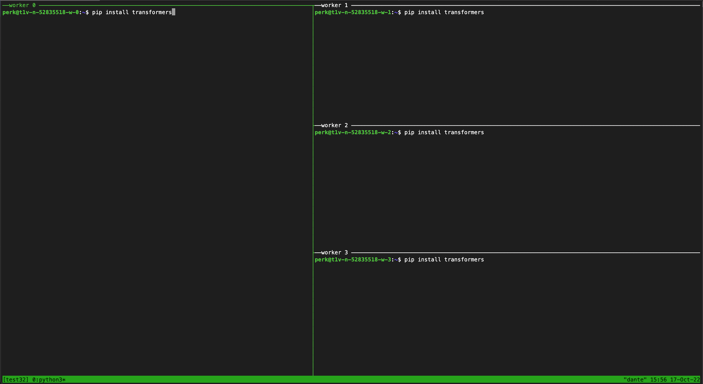

# ttconnect
A script for combining the power of [tmux](https://github.com/tmux/tmux/wiki) with the TPU-v4 VMs. 


## Installation
```bash
# Download ttconnect
wget https://raw.githubusercontent.com/peregilk/ttconnect/main/ttconnect

# Make the program executable
chmod a+x ttconnect

# Optionally copy it to a place in your path (like /usr/local/bin/)
```

## Use
While the script also works on a single TPU slice, its main purpose is when working with the pods. It will automatically open a tmux window with a tile for each of the TPU slices, allowing them to be controlled both in parallel and individually.

```bash
# Open a connection to an already existing TPU VM or TPU-VMs. 
./ttconnect [TPU name]

````

This command will open connections to all the workers in a tmux with split panes. A typical workspace for a v4-32 looks like this:



The default setting is syncronized panes. Whatever you type in one pane, will then happen in all the panes. However, if you like to make a change only to one of the TPUs, you can turn off this behaviour by setting:

```bash
C-b: setw synchronize-panes off
```

## Known issues
* Please set the zone in the beginning of the script. In the future it will use the default zone.

## Feedback
This is the first version of this script. There are a lot of possible features that might be added here. For instance more info about the pod  in the Window title bar, nicer colors, shortcuts etc. Feel free to modify the script, and to add suggestions. I will be glad to add them into the script. Please send any comments to [per@capia.no](mailto:per@capia.no).

